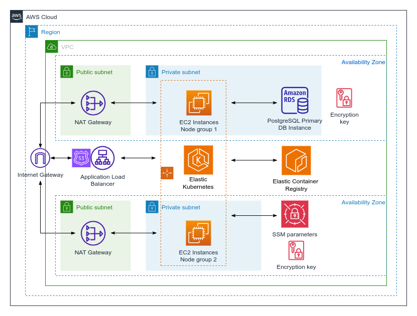
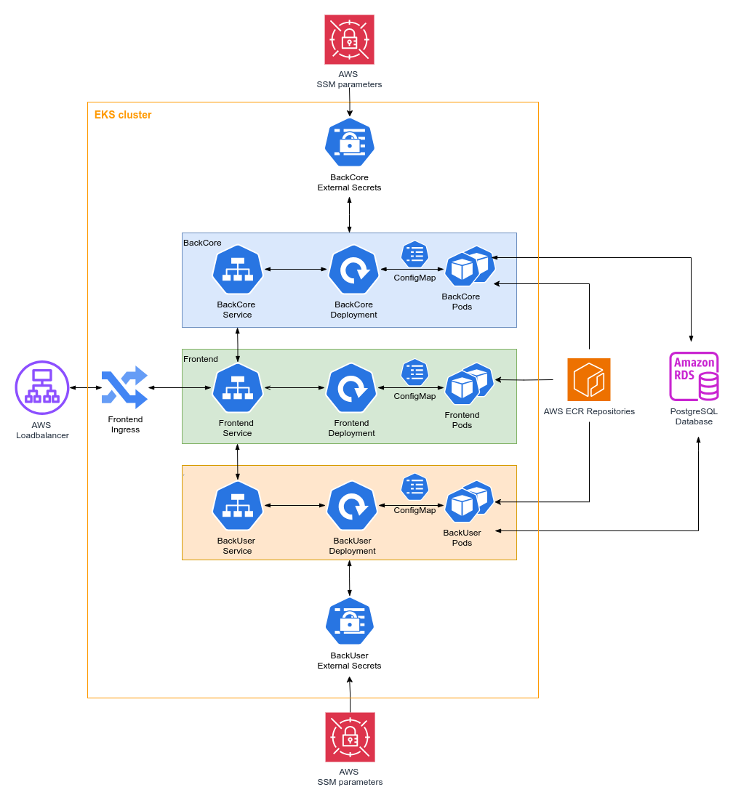
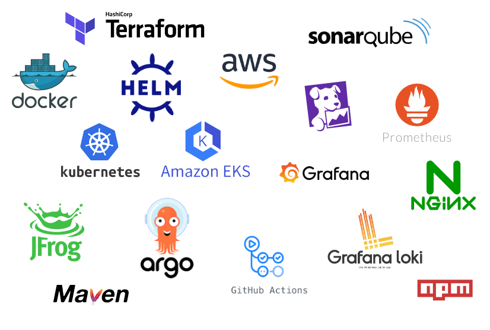

GreenCity is a project developed by multiple groups of students of Softserve Academy using Java + Spring Boot for the backend and Typescript + Angular for the frontend.

During the DevOps Project-Level course at Softserve Academy, I was given the source code of the backend and frontend parts of the GreenCity application.

My main tasks were to:
  1. Containerize the application and deploy it locally
  2. Deploy project to Kubernetes cluster on a cloud of my choice
  3. Write infrastructure code
  4. Implement Continuous Integration and Continuous Deployment
  5. Implement monitoring and logging
  6. Add artifact management

I used Terraform to create infrastructure on AWS that includes:
 - ECR repositories for frontend and backend
 - EKS cluster
 - RDS database
 - Security groups, IAM roles, IAM policies

My Terraform code provisions a fully functional Kubernetes cluster and installs extra things such as external secrets, external DNS, AWS load balancer controller, and monitoring and logging stack. ArgoCD installation is also provisioned via Terraform code. As soon as ArgoCD is installed it automatically deploys frontend and backend parts of the GreenCity application as Helm charts.

Additionally, Terraform handles installing monitoring and logging stacks. I used Prometheus and Datadog agents for monitoring, Loki for logging, and Grafana to visualize metrics and logs.

CI/CD was implemented using GitHub Actions workflows and ArgoCD for the GitOps approach.
As a part of continuous integration, I included:
 - static code analysis with self-hosted SonarQube
 - checking docker image size efficiency using Dive
 - scanning docker image for vulnerabilities with Trivy and Grype

 **Project infrastructure:**

**Kubernetes cluster components:**

**Technologies used:**

